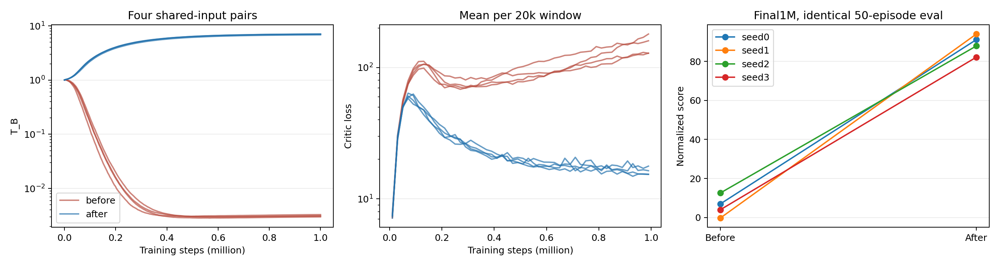

# TD3+AMO L2_RMS highest: 1M 수정 전·후 비교

실제 JAX 학습 코드에서 L2_RMS의 virtual bootstrap update·actor·target-Q·미분 경로를 highest로 고정했다. L1은 호출자의 정밀도를 유지한다. loss 수식·stop-gradient·하이퍼파라미터·업데이트 순서는 바꾸지 않았다. 수정 전 코드는 `source_before/`, 수정본은 `source_after/`에 보존했다.

## 회귀 검사

이전에 부호가 뒤집혔던 상태를 포함한 8개 동일 상태에서 수정 후 합산 T_B gradient 부호는 8/8 Torch와 같았다. 크기의 최대 상대차는 1.361%였다. 실제 수정본과 진단용 l2_highest 개입은 출력 전체 상태·기록한 중간값까지 차이 0이었다. critic-only와 non-meta actor update도 수정 전과 차이 0이었다.

메타 JIT의 L1 값에는 최대 4.77e-7, L1 gradient에는 최대 6.15e-10의 반올림 차이가 있었다. T_E loss/gradient는 검사 상태에서 정확히 같았다. L1까지 비트 일치를 요구했던 초기 검사는 이 차이로 실패했고, 그 로그도 보존했다. 별도의 CPU 단위 검사 2개는 L1/L2 각각의 값·gradient 및 최적화된 그래프의 정밀도 범위를 검증했다.

## 실험 조건

walker2d-medium-replay-v2, training seed 0–3, 각 1M steps. T_E=T_B=1, T_lr=1e-3, batch/width=256, actor/critic lr=3e-4, meta_interval=20. 각 seed의 두 분기는 전체 초기 state 및 inner batch·독립 outer batch·target noise를 공유한다. 데이터·정규화도 동일하다. 네 seed의 최종 입력 SHA256을 쌍별로 확인했다.

두 분기 모두 JAX global matmul precision은 default, XLA GPU autotune=0이다. 네트워크 업데이트에는 production BaseAgent.update를 사용했고 scan/vmap으로 학습을 재구성하지 않았다. GPU RTX5080, JAX/jaxlib0.10.2/Python3.11.15. 공유 GPU에서 다른 작업들과 함께 실행됐으며 후반의 실행 스케줄 변경은 아래에 기록했다.

최종 step1M checkpoint만 평가했다. 모든 정책을 같은 Torch2.8.0 CPU 구현으로 로드해 execution actor를 사용했다. 평가 env seed=0을 한 번 설정한 후 50 episodes를 순차 실행했다. 평균±SD의 SD는 네 training seed 사이의 표본 표준편차(ddof=1)다. 50 episodes를 training seed 50개로 세지 않는다.

## 최종 결과

| 조건 | 정규화 점수 평균 ± SD | raw return 평균 ± SD | T_B 평균 ± SD | 마지막50k critic loss 평균 ± SD |
|---|---:|---:|---:|---:|
| before | 5.795 ± 5.389 | 267.658 ± 247.392 | 0.003 ± 0.000 | 146.618 ± 22.494 |
| after | 88.790 ± 5.084 | 4077.682 ± 233.370 | 6.995 ± 0.106 | 16.215 ± 1.004 |

| Seed | 수정 전 점수 | 수정 후 점수 | 차이 | 수정 전 T_B | 수정 후 T_B |
|---|---:|---:|---:|---:|---:|
| 0 | 6.947 | 91.136 | +84.188 | 0.003292 | 7.078876 |
| 1 | -0.278 | 93.990 | +94.268 | 0.003130 | 7.055199 |
| 2 | 12.546 | 87.890 | +75.344 | 0.002989 | 7.002248 |
| 3 | 3.965 | 82.144 | +78.179 | 0.003092 | 6.844343 |

쌍별 점수 변화 평균은 +82.995, 표본 SD는 8.371다. 이것을 통계적 유의성 검정 결과로 해석하지 않는다.

검사한 네 seed 모두에서 수정 후 최종 성능이 개선됐고, 최종 T_B 저하·낮은 점수에 대한 추가 진단 기준에 해당하는 실행은 없었다. 동일한 초기 상태와 학습 입력을 사용한 수정 전·후 비교이므로, 이 환경과 스택에서는 L2_RMS 경로의 정밀도 수정이 1M 성능 회복에 효과가 있었다고 판단한다.

## 판정 범위

이 결과는 검사한 환경·4개 seed·현재 스택에서의 수정 효과다. 과거 서버의 원본 Torch/JAX 실험은 초기 상태와 평가 방식이 달랐으므로, 여기서는 동일 입력의 JAX 수정 전·후 비교를 결론의 근거로 사용한다. 다른 환경이나 모든 seed에서의 동등성까지 주장하지 않는다.

수정 후 최종 T_B<0.1 또는 점수<50인 실행은 추가 메타 진단 대상으로 표시한다. 이는 사전 탐색용 운영 기준이며 통계적 붕괴 정의가 아니다. 조건이 발생한 경우 `conditional_diagnosis/` 산출물을 함께 읽어야 한다.

## 재현 자료

실험 루트는 `results/td3_amo_l2_highest_1m_20260914`다. 루트의 `contract.json`과 `suite.command.json`에 실험 범위와 실제 실행 명령이 있다. `execution/manifest.json`은 학습 입력·출력 해시, 실행 시간과 제한을 기록한다. `regression/`, `unit_tests.log`는 회귀 근거다. `shared/seed*/`는 초기 state와 memmap tapes, `runs/`는 학습 곡선·checkpoint·평가 원본이다. 이 보고서와 같은 폴더의 `manifest.json`에는 집계에 사용한 원본 곡선·평가 파일의 해시가 있고, `SUMMARY.json`에 기계 판독 가능한 결과가 있다. 기존 checkpoint는 삭제하지 않았다.

## 실행 스케줄 변경

seed 0·1은 순차 실행했고, seed 2 수정 전 학습 도중 공유 작업공간의 별도 스케줄러가 원래 큐를 일시정지한 뒤 남은 학습을 최대 2개씩 병렬 실행했다. 동일한 worker·환경변수·입력 tape를 사용했고, 원래 큐는 모든 평가 후 다시 진행해 최종 산출물을 기록했다. 전환 이유와 시각·실행 이벤트는 `execution/parallel_transition.json`, `parallel_events.jsonl`에 보존돼 있다. 이 스케줄 차이 때문에 실행 시간은 패치 속도 비교로 해석하지 않는다.
